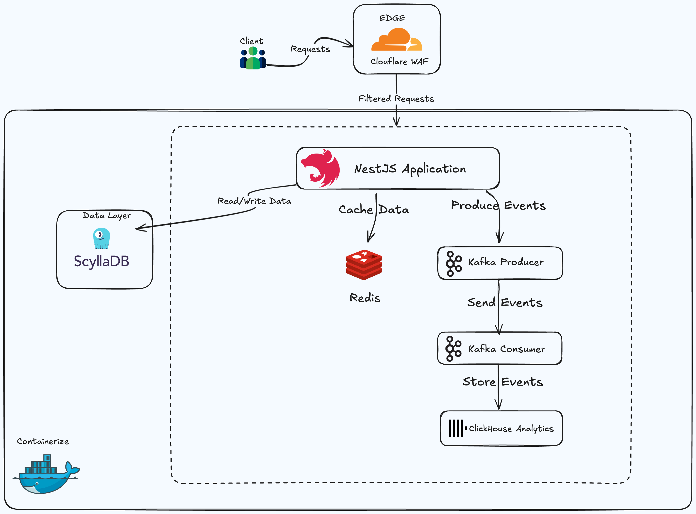

# DistLink - Distributed URL Shortener System

## Overview

DistLink is a high-performance, distributed URL shortener designed to handle millions of requests per second. Built with modern technologies like NestJS, ScyllaDB, Kafka, Redis, and Kubernetes, it offers fast URL redirects, real-time analytics, and robust anti-spam protection. This project is designed for scalability, fault tolerance, and low latency, making it ideal for high-traffic applications.

Frontend: [DistLink Frontend](https://github.com/Azzurriii/DistLink-UI)

## Features

*   **High Performance:** Optimized for millions of requests per second.
*   **Scalability:** Designed for horizontal scaling with Kubernetes.
*   **Real-time Analytics:** Track URL clicks and user behavior with Kafka and ClickHouse.
*   **Anti-Spam Protection:** Cloudflare WAF integration for security and rate limiting.
*   **Fault Tolerance:** Distributed architecture with data replication in ScyllaDB and Kafka.
*   **Automatic Link Expiration:** TTL (Time-To-Live) implemented in ScyllaDB for automatic removal of old links.

## System Architecture

The architecture prioritizes scalability, fault tolerance, and low latency.



### 1. Edge Layer (Security & Rate Limiting)

*   **Cloudflare WAF:**
    *   Protects against DDoS attacks, bot traffic, and other web vulnerabilities.
    *   Implements rate limiting to prevent abuse and ensure fair usage.

### 2. API Layer (NestJS Microservice)

*   **NestJS Application:**
    *   Handles URL shortening and redirection requests.
    *   Exposes REST API endpoints for easy integration.
    *   Implements caching using Redis to reduce database load and improve response times.
    *   Publishes click events to Kafka for real-time analytics.
    *   Includes API documentation using Swagger/OpenAPI (Optional, but recommended).

### 3. Database Layer (Scalable Storage)

*   **ScyllaDB (NoSQL Database):**
    *   Provides high-throughput storage for URL mappings, ensuring fast lookups.
    *   Uses a **partition key (short_code)** for efficient data distribution and retrieval.
    *   Implements **TTL (Time-To-Live)** to automatically expire links after a configured period, preventing database bloat.
    *   Uses CQL for data modeling.

### 4. Caching Layer (Performance Optimization)

*   **Redis:**
    *   Stores frequently accessed URL mappings in-memory for ultra-fast retrieval.
    *   Significantly reduces database load for high-traffic URLs, improving overall system performance.
    *   Utilizes a configurable TTL to automatically expire cached entries.

### 5. Event Processing & Analytics

*   **Kafka Cluster:**
    *   Acts as a distributed event streaming platform.
    *   Kafka Producers send click tracking events containing metadata like IP address, user-agent, and timestamp.
    *   Kafka Consumers process these events and store them in ClickHouse.
*   **ClickHouse (Analytics Database):**
    *   Stores user click events for real-time reporting and analysis.
    *   Supports high-speed aggregations and queries, enabling the creation of insightful dashboards.
    *   Consider mentioning the schema for the ClickHouse table (short_code, timestamp, ip_address, user_agent, referrer, etc.).

### 6. Deployment & Orchestration

*   **Docker:**
    *   Containerizes all services, ensuring consistent and reproducible deployments across different environments.
*   **Kubernetes (K8s):**
    *   Orchestrates containerized services, automating deployment, scaling, and management.
    *   Ensures **auto-scaling** of services based on load, maintaining optimal performance.
    *   Provides **self-healing** capabilities, automatically restarting failed containers.
    *   Supports **rolling updates**, allowing for seamless deployments without downtime.
*   **Ingress Controller (Traefik/Nginx):**
    *   Manages external HTTP traffic into the Kubernetes cluster, routing requests to the appropriate services.
    *   Provides load balancing and SSL termination.

## Workflow

### 1. Shorten URL (`POST /shorten`)

1.  The API receives a request to shorten a long URL.
2.  Cloudflare WAF filters the request to prevent malicious activity.
3.  The NestJS application generates a unique `short_code` (consider mentioning the algorithm used for generating the code, e.g., base62 encoding).
4.  The application checks the Redis cache for the `short_code`.
5.  If the `short_code` is not found in Redis (cache miss), the URL mapping is stored in ScyllaDB and the Redis cache is updated.
6.  The shortened URL is returned to the user.

### 2. Redirect URL (`GET /:short_code`)

1.  A user accesses a shortened URL.
2.  Cloudflare WAF filters the traffic.
3.  The NestJS application checks the Redis cache for the original URL associated with the `short_code`.
4.  If the cache misses, the application fetches the URL mapping from ScyllaDB and updates the Redis cache.
5.  A click event is logged to Kafka, including metadata such as IP address, user-agent, and timestamp.
6.  The user is redirected to the original URL.

### 3. Track Clicks (Kafka Consumer & ClickHouse)

1.  Kafka Consumer subscribes to the click event topic in Kafka.
2.  The consumer processes the click events and stores the click metadata (IP, user-agent, timestamp, referrer) in ClickHouse.
3.  Real-time dashboards query analytics data in ClickHouse to provide insights into URL usage.

## Getting Started

### Prerequisites

*   Docker
*   Docker Compose (for local development)
*   Kubernetes cluster (for production deployment)
*   kubectl (Kubernetes command-line tool)

### Installation

1.  **Clone the repository:**

    ```bash
    git clone https://github.com/Azzurriii/DistLink.git
    cd DistLink
    ```

2.  **Configure Environment Variables:**

    Create a `.env` file based on the `.env.example` template.  Fill in the necessary configuration parameters for your environment (database credentials, Kafka brokers, Redis connection details, etc.).

3.  **Local Development (Docker Compose):**

    ```bash
    docker-compose up -d
    ```

    This will start all the necessary services in Docker containers.

4.  **Access the API:**

    The API will be accessible at `http://localhost:3000`.  Refer to the NestJS application's configuration for the specific port.

5. **Check the logs**
```bash
   docker-compose logs -f
```

## Production Deployment (Kubernetes)

1.  **Build Docker Images:**

    Build Docker images for each service (NestJS API, Kafka Consumer, etc.) and push them to a container registry (e.g., Docker Hub, Google Container Registry, AWS ECR).  Add a Dockerfile to your project and include build instructions in the README.

2.  **Configure Kubernetes Manifests:**

    *   The `k8s/` directory should contain Kubernetes manifests (YAML files) for deploying the services.
    *   Customize the manifests with your container image names, resource requirements, and other configuration settings.
    *   Use ConfigMaps and Secrets to manage environment variables and sensitive information.
    *   Include manifests for:
        *   Deployments (NestJS API, Kafka Consumer)
        *   Services (LoadBalancer or NodePort for external access)
        *   StatefulSet (ScyllaDB)
        *   PersistentVolumeClaims (for ScyllaDB data persistence)
        *   Ingress (for routing traffic to the API)
        *   HorizontalPodAutoscaler (for auto-scaling the API)

3.  **Deploy to Kubernetes:**

    ```bash
    kubectl apply -f k8s/
    ```

    This will deploy all the services to your Kubernetes cluster.

4.  **Verify Deployment:**

    ```bash
    kubectl get pods
    kubectl get services
    kubectl get deployments
    ```

    Check that all pods are running and services are accessible.

### Scaling Services

*   **NestJS API:**  Horizontal Pod Autoscaler (HPA) automatically scales the number of API pods based on CPU utilization or other metrics.  Configure the HPA with appropriate minimum and maximum replica counts.
*   **ScyllaDB:**  Use a StatefulSet to manage ScyllaDB for high availability and data persistence.  Ensure proper replication and data distribution across nodes.
*   **Kafka:**  Deploy Kafka in a multi-broker setup for fault tolerance.  Configure topic replication to ensure data durability.

## Contributing

Please read `CONTRIBUTING.md` for details on our code of conduct, and the process for submitting pull requests to us.
